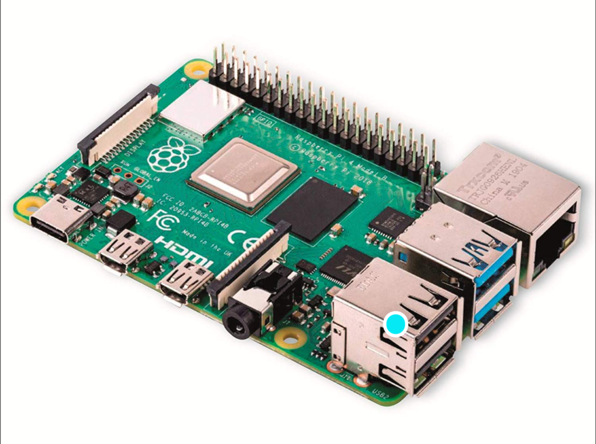
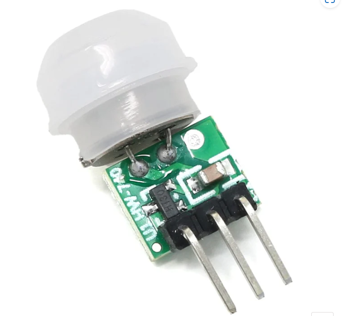
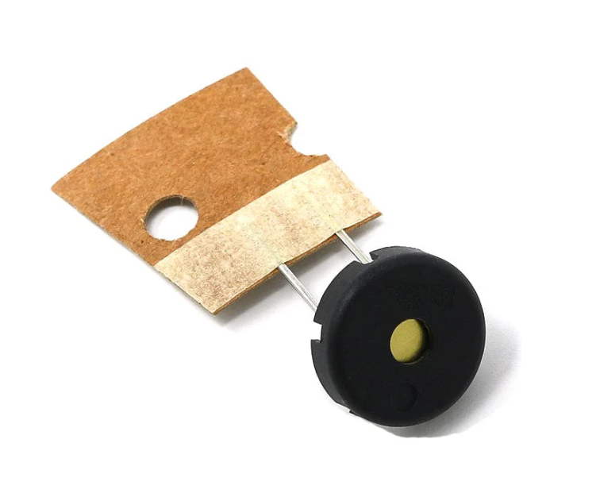
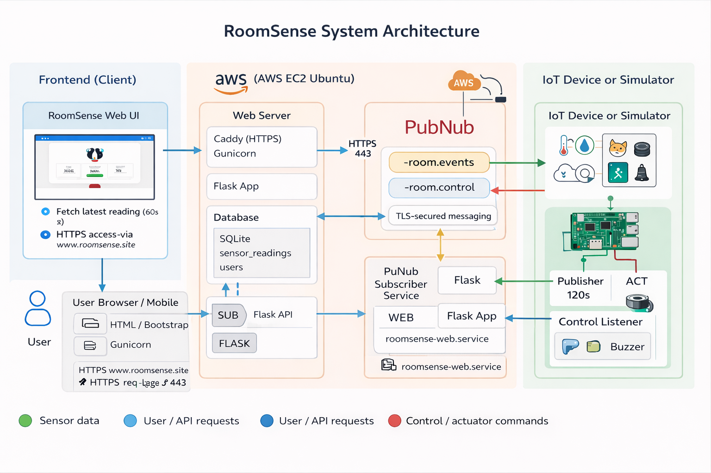

# RoomSense 🏠🌡️

RoomSense is an IoT-based smart room monitoring system developed as part of the **IoT Development – Individual Continuous Assessment (CA)**.

The system collects real-time environmental and motion data using a sensor-equipped Raspberry Pi and visualises this data through a secure, cloud-hosted web dashboard.

---

## What is RoomSense? ❔

RoomSense is a hardware–software system that allows users to remotely monitor a room’s **temperature**, **humidity**, and **motion activity** in near real-time.

It is designed to demonstrate:
- IoT data collection
- Cloud communication using Pub/Sub messaging
- Secure web-based visualisation
- Backend data storage and retrieval

The system uses physical sensors to publish readings at fixed intervals, which are then processed and displayed via a Flask web application.

---

## Live Website 🌐

You can access the deployed dashboard here:

👉 **https://roomsense.site**

> **Note:**  
> This is an academic project. Sensor data is generated via a simulator or connected device. Future versions may support multiple devices and users.

---

## Technologies Used 🧑‍💻

### Software
- **Python**
- **Flask** (Backend & API)
- **Gunicorn** (WSGI server)
- **Caddy** (Reverse proxy & HTTPS)
- **Bootstrap** (Frontend UI)
- **JavaScript** (Dashboard refresh logic)
- **SQLite / MySQL** (Data storage)
- **PubNub** (Real-time messaging)

### Cloud & Infrastructure
- **Amazon Web Services (AWS EC2)**
- **HTTPS (TLS via Caddy)**

### Hardware
- **Raspberry Pi 400**
- **PIR Motion Sensor**
- **Environmental Sensor (Temperature & Humidity)**
- **Buzzer (Actuator / feedback)**

#### Hardware Images

---

## Hardware Setup 👷

- Sensors are connected to a Raspberry Pi.
- The Pi (or simulator) publishes sensor readings to PubNub.
- Motion events can trigger an actuator (buzzer).
- Readings are forwarded to the backend for storage and visualisation.

> A Fritzing diagram is used to document physical wiring connections.

---

## System Architecture 🌉

---

## Features Implemented ✅

- Real-time temperature, humidity, and motion monitoring
- Secure user authentication (login & registration)
- Password hashing using **Bcrypt**
- Session-based authentication
- REST API for sensor readings (`/api/readings`)
- Automated dashboard refresh (every 60 seconds)
- Sensor publish interval configurable (default: 120 seconds)
- Cloud deployment with HTTPS
- Modular backend architecture (API, database, messaging separated)

---

## Features to Be Implemented 📋

- Support for multiple devices per user
- Device registration & management
- User roles (admin / standard user)
- Historical charts & analytics
- Alert thresholds (e.g. temperature warnings)
- Email or push notifications
- Migration to managed cloud database (RDS)

---

## Update Intervals ⏱️

- **Sensor publish interval:** 120 seconds  
- **Dashboard refresh interval:** 60 seconds  

This balance reduces database load while still providing near real-time feedback suitable for demonstrations and coursework.